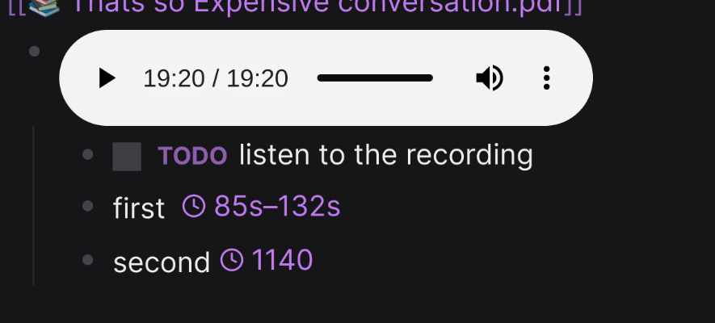

# Audio Snippet

Like Youtube bookmark but for embedded audio files

# Usage

In a logseq block the structure should be

* audio
* first {{renderer audio-snippet 85 132}}
* second {{renderer audio-snippet 1140}}

Which is then rendered similar to



To start and stop the audio snippet
```
{{renderer audio-snippet 85 132}}
```

To start at a specific time with no end
```
{{renderer audio-snippet 85}}
```
